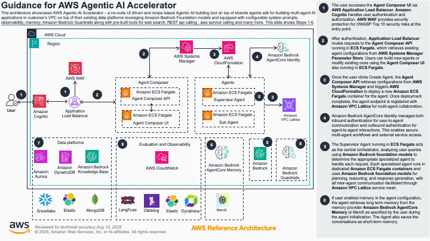
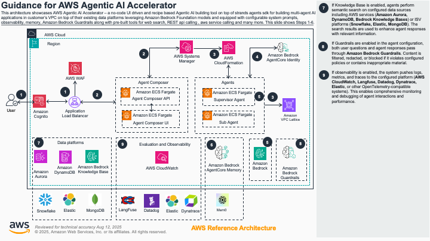

# Guidance for Agentic AI Accelerator on AWS

## Table of Contents

1. [Overview](#overview)
2. [Architecture](#architecture)
3. [Cost](#cost)
4. [Prerequisites](#prerequisites)
5. [Deployment Steps](#deployment-steps)
6. [Post-deployment](#post-deployment)
7. [Running the Guidance](#running-the-guidance)
8. [Cleanup](#cleanup)
9. [Additional Considerations](#additional-considerations)

## Overview

This guidance demonstrates how to build and deploy a sophisticated multi-agent AI accelerator platform on AWS. The solution provides an enterprise-grade agentic AI system featuring dynamic agent coordination, comprehensive knowledge base integrations, and advanced streaming capabilities.

### Why This Guidance Exists

Organizations today face significant challenges when building enterprise-scale AI systems that can handle complex, multi-faceted tasks requiring different types of expertise. Traditional single-agent AI solutions often fall short when dealing with scenarios that require:

- **Coordinated expertise**: Tasks that need different specialized knowledge domains (financial analysis, document search, data warehousing)
- **Dynamic scalability**: Systems that can adapt to changing workloads without manual intervention
- **Enterprise security**: Production-ready authentication, authorization, and compliance requirements
- **Multi-source data integration**: Seamless access to various knowledge bases and data stores
- **Real-time interaction**: Streaming responses and conversational memory across sessions

This guidance solves these challenges by providing a complete, production-ready architecture for building multi-agent AI systems on AWS. Instead of organizations having to architect these complex systems from scratch, this guidance provides a tested, scalable foundation that leverages AWS managed services for reliability, security, and operational excellence.

The solution addresses the gap between simple AI chatbots and enterprise-grade agentic AI platforms, enabling organizations to deploy sophisticated AI workflows that can coordinate multiple specialized agents, maintain conversation context, and integrate with existing enterprise data sources while following AWS security best practices.

### Key Features

- **Multi-Agent Architecture**: Supervisor agent coordinates with specialized agents via A2A (Agent-to-Agent) communication protocol
- **Dynamic Configuration**: Runtime agent management without service restarts through configuration APIs
- **Knowledge Base Integrations**: Support for Elasticsearch, Amazon Bedrock Knowledge Bases, Snowflake, MongoDB Atlas, and Aurora PostgreSQL
- **Agent Memory Support**: Multiple memory providers including mem0, Bedrock Agent Core, and OpenSearch with persistent conversation memory
- **Streaming Responses**: Real-time agent interactions with advanced streaming capabilities
- **Modern React UI**: Comprehensive web interface for agent configuration and management
- **🌐 CloudFront Integration**: Dual access modes with VPC origins pattern - public mode via CloudFront global edge network (no certificate required) or private mode via direct ALB access (customer certificate required)
- **🔐 Configurable Geo-Restriction**: CloudFront geo-restriction with configurable country lists for regional access control or global access
- **Enterprise Security**: AWS Cognito authentication, Bedrock Agentcore Identity Standalone, guardrails, and comprehensive monitoring with WAF protection
- **🔐 Enterprise OAuth 2.0 Authentication**: JWT Bearer token authentication with extensible identity provider support (AWS Cognito, Okta, Ping, Auth0)
- **🎭 Role-Based Access Control (RBAC)**: Fine-grained permissions system with admin, agent-creator, supervisor-user, and readonly-user roles
- **🔑 Provider-Agnostic Architecture**: Configuration-driven authentication system supporting multiple identity providers
- **🔐 SecureString Parameter Store**: All configuration data encrypted at rest using customer-managed KMS keys with Advanced Tier support
- **🔑 Customer-Managed Encryption**: Full control over encryption keys with automatic rotation and comprehensive audit trails
- **🛡️ CloudWatch Logs Data Protection**: Automatic sensitive data detection and masking using AWS managed identifiers and custom patterns for platform-specific secrets
- **📊 Audit Findings to CloudWatch**: Comprehensive audit trail of sensitive data detection delivered to dedicated CloudWatch log groups for monitoring and analysis
- **🔒 IAM Permissions Boundaries**: Service-specific permissions boundaries that limit maximum privileges and prevent privilege escalation across all compute resources
- **Infrastructure as Code**: Complete CDK v2 implementation with security best practices and CDK Nag compliance
- **Blue-Green Deployment**: Production-ready deployment patterns with health checks
- **MCP Integration**: Model Context Protocol support for extensible tool integration
- **Observability**: Multiple providers including Langfuse, Dynatrace, Datadog, Elastic APM, OpenTelemetry, and Bedrock Agentcore Observability with comprehensive CloudWatch monitoring

### Use Cases

- **Enterprise Knowledge Management**: Deploy specialized agents for different domains with integrated knowledge bases
- **Customer Support Automation**: Multi-agent systems that can handle complex customer inquiries with context switching
- **Data Analysis Workflows**: Coordinate agents across different data sources (Snowflake, Aurora, Elasticsearch)
- **Research and Development**: Prototype and deploy advanced AI workflows with supervisor-agent patterns
- **Financial Services Intelligence**: Specialized agents for financial data analysis and compliance

### Target Audience

This guidance is designed for:
- Solution architects implementing enterprise AI systems
- DevOps engineers deploying production AI workloads
- Data engineers integrating multiple knowledge sources
- AI/ML engineers building multi-agent systems
- Organizations requiring enterprise-grade agentic AI platforms

## Architecture

The Agentic AI Accelerator implements a sophisticated multi-agent architecture built on AWS managed services.

### Architecture Diagrams



*Figure 1: Agentic AI Accelerator Architecture - Agent Creation and Orchestration Flow (Steps 1-7)*



*Figure 2: Agentic AI Accelerator Architecture - Agent Processing and Integration Flow (Steps 8-10)*

### Architecture Flow Overview

The Agentic AI Accelerator follows a comprehensive 10-step process for agent creation, orchestration, and execution:

#### Phase 1: Agent Creation and Setup (Steps 1-7)

1. **User Access & Authentication**: Users access the Agent Composer UI via AWS Application Load Balancer. Amazon Cognito handles user authentication and authorization. AWS WAF provides comprehensive security protection against OWASP Top 10 vulnerabilities using AWS Managed Rules Common Rule Set.

2. **Configuration Retrieval**: After authentication, user requests are sent to Agent Composer API which retrieves configurations of existing agents from AWS Systems Manager.

3. **Agent Management**: Users can build new agents or modify existing agents using the Agent Composer UI with intuitive configuration options.

4. **Dynamic Agent Deployment**: When users click "Create Agent", the Agent Composer API saves agent configurations in AWS Systems Manager and deploys an AWS CloudFormation template to spin up AWS ECS Fargate containers for the agent.

5. **Service Registration**: Once agent creation is complete, the system publishes the agent endpoint through Amazon VPC Lattice for multi-agent collaboration and service discovery.

6. **Multi-Agent Workflow Initialization**: With the multi-agent workflow created, users can start interacting with agents. Amazon Bedrock Agentcore Identity handles both inbound and outbound authentication.

7. **Supervisor Orchestration**: The Supervisor Agent acts as the central orchestrator, analyzing user queries using Amazon Bedrock foundation models and determining the appropriate specialized agent to handle each request.

#### Phase 2: Agent Processing and Integration (Steps 8-10)

8. **Knowledge Base Integration**: If knowledge base is enabled in agent configuration, the agent performs semantic search on AWS data sources (Amazon Aurora, Amazon DynamoDB, Amazon Bedrock Knowledge Bases) or ISV data sources (Snowflake, Elasticsearch, MongoDB) as specified by the user.

9. **Content Filtering**: If guardrails are enabled in agent configuration, user questions and final responses pass through Amazon Bedrock guardrails and are redacted or filtered if inappropriate content is detected.

10. **Observability and Monitoring**: If observability is enabled in agent configuration, the system pushes logs, metrics, and traces to AWS CloudWatch, Langfuse, Datadog, Dynatrace, Elastic, or any other OpenTelemetry-compatible observability platform.

### Core Components

#### 1. Multi-Agent Orchestration Layer
- **Supervisor Agent**: Coordinates task distribution and agent communication using advanced models (Claude Opus 4, Sonnet 4)
- **Specialized QA Agents**: Domain-specific agents with configurable knowledge bases and memory systems
- **A2A Communication Protocol**: Secure agent-to-agent communication with streaming support
- **Dynamic Agent Deployment**: Runtime agent provisioning through ECS Fargate

#### 2. Infrastructure Layer
- **Amazon VPC**: Isolated network environment with multi-AZ deployment
- **Amazon ECS Fargate**: Serverless container orchestration for all agent services
- **AWS VPC Lattice**: Service mesh for secure inter-service communication with built-in AI agent registry and discovery mechanisms
- **Application Load Balancer**: High-availability load balancing with health checks
- **Amazon Cognito**: User authentication and authorization

*Note: The VPC Lattice service mesh provides advanced agent registry and discovery capabilities, allowing agents to automatically discover and communicate with each other without hard-coded endpoints. This enables dynamic scaling and flexible agent deployment patterns while maintaining security and network isolation.*

#### 3. Knowledge Integration Layer
- **Amazon Bedrock Knowledge Bases**: Managed vector search with RAG capabilities
- **Elasticsearch**: Custom knowledge base with vector embeddings
- **MongoDB Atlas**: Document database with vector search capabilities
- **Amazon Aurora PostgreSQL**: Structured data with AI-powered SQL generation
- **Snowflake Integration**: Data warehouse connectivity with Cortex AI
- **Vector Embeddings**: Amazon Titan and Cohere embedding models

#### 4. Configuration and Management
- **Configuration API**: RESTful API for dynamic agent management
- **React UI**: Modern web interface for agent configuration and monitoring
- **AWS Systems Manager Parameter Store**: Centralized configuration management
- **Dynamic Deployment**: Agent provisioning without service interruption

#### 5. Observability and Security
- **Multi-Provider Observability**: Support for Langfuse, Dynatrace, Datadog, Elastic APM, OpenTelemetry, and Bedrock Agentcore Observability
- **Amazon CloudWatch**: Metrics, logs, and monitoring
- **AWS Bedrock Guardrails**: Content filtering and safety controls
- **Memory Management**: Multiple providers (mem0, Bedrock Agent Core, OpenSearch)

### Service Communication Flow

1. **User Interaction**: Users interact through the React UI or direct API calls
2. **Authentication**: AWS Cognito validates user credentials
3. **Request Routing**: Application Load Balancer routes requests to appropriate services
4. **Supervisor Coordination**: Supervisor agent analyzes requests and delegates to specialized agents
5. **Agent Processing**: Specialized agents process tasks using their configured knowledge bases
6. **Knowledge Retrieval**: Agents query configured knowledge sources (Bedrock KB, Elasticsearch, etc.)
7. **Response Aggregation**: Supervisor agent aggregates results and streams responses
8. **Observability**: All interactions are logged and monitored through Langfuse and CloudWatch

### Deployment Architecture

The solution deploys across multiple AWS stacks:
- **VPC Stack**: Network infrastructure and ECS cluster
- **Configuration API Stack**: Agent management services
- **Multi-Agent Stack**: Generic agent instances
- **Supervisor Agent Stack**: Orchestration services
- **UI Stack**: React web application
- **SSM Stack**: Parameter management

## Cost

You are responsible for the cost of the AWS services used while running this Guidance. As of September 2025, the cost for running this Guidance with the default settings in the US East (N. Virginia) region is approximately $542.66 per month for processing 10,000 agent interactions, including SecureString parameter encryption and customer-managed KMS key costs.

This section provides estimated costs for running the Agentic AI Accelerator on AWS in the US East 1 (Virginia) region.

### Cost Assumptions

Cost estimates are based on the following assumptions and actual AWS pricing (US East 1, September 2025):

**Infrastructure Configuration (from `config/development.yaml`):**
- **Configuration API**: 2 vCPU, 4GB RAM, 2 instances
- **Agent Services**: 2 vCPU, 4GB RAM, 2 instances  
- **Supervisor Agent**: 2 vCPU, 4GB RAM, 1 instance
- **React UI**: 1 vCPU, 2GB RAM, 1 instance
- **Total Resources**: 11 vCPU, 22GB RAM per deployment

**Usage Patterns:**
- **Development**: 8 hours/day, 5 days/week (160 hours/month)
- **Production**: 24/7 operation (720 hours/month)
- **Enterprise**: 24/7 with additional scaling (1,440 vCPU-hours/month)

**AWS Pricing References (US East 1):**
- **ECS Fargate**: $0.000011244 per vCPU-second, $0.000001235 per GB-second (Linux x86)
- **Application Load Balancer**: $0.0225 per hour + LCU charges ($0.008 per LCU)
- **VPC Lattice**: $0.025 per service network per hour + data processing charges

### Detailed Cost Breakdown

All cost calculations based on US East 1 (Virginia) pricing as of September 2025.

#### Service Dimensions and Configurations

| Service | vCPU | Memory | Instances | Runtime Hours | Total vCPU-Hours | Total GB-Hours |
|---------|------|--------|-----------|---------------|------------------|----------------|
| **Configuration API** | 2 | 4GB | 2 | 160/720/720* | 640/2,880/2,880 | 1,280/5,760/5,760 |
| **Generic Agent (QA)** | 2 | 4GB | 2 | 160/720/720* | 640/2,880/2,880 | 1,280/5,760/5,760 |
| **Supervisor Agent** | 2 | 4GB | 1 | 160/720/720* | 320/1,440/1,440 | 640/2,880/2,880 |
| **React UI** | 1 | 2GB | 1 | 160/720/720* | 160/720/720 | 320/1,440/1,440 |
| **TOTAL RESOURCES** | **7 vCPU** | **14GB** | **6 instances** | **Dev/Prod/Ent*** | **1,760/7,920/7,920** | **3,520/15,840/15,840** |

*Runtime hours: Development (160h/month), Production (720h/month), Enterprise (720h/month with higher scaling)

#### ECS Fargate Cost Calculations

**Pricing:** vCPU = $0.000011244/second ($0.04048/hour), Memory = $0.000001235/GB-second ($0.004446/GB-hour)

| Service | Development (160h) | Production (720h) | Enterprise (720h) |
|---------|-------------------|-------------------|------------------|
| **Configuration API** | | | |
| - vCPU cost (640/2,880/2,880 vCPU-hours) | $25.91 | $116.58 | $116.58 |
| - Memory cost (1,280/5,760/5,760 GB-hours) | $5.69 | $25.61 | $25.61 |
| - **Subtotal** | **$31.60** | **$142.19** | **$142.19** |
| **Generic Agent (QA)** | | | |
| - vCPU cost (640/2,880/2,880 vCPU-hours) | $25.91 | $116.58 | $116.58 |
| - Memory cost (1,280/5,760/5,760 GB-hours) | $5.69 | $25.61 | $25.61 |
| - **Subtotal** | **$31.60** | **$142.19** | **$142.19** |
| **Supervisor Agent** | | | |
| - vCPU cost (320/1,440/1,440 vCPU-hours) | $12.95 | $58.29 | $58.29 |
| - Memory cost (640/2,880/2,880 GB-hours) | $2.84 | $12.81 | $12.81 |
| - **Subtotal** | **$15.79** | **$71.10** | **$71.10** |
| **React UI** | | | |
| - vCPU cost (160/720/720 vCPU-hours) | $6.48 | $29.15 | $29.15 |
| - Memory cost (320/1,440/1,440 GB-hours) | $1.42 | $6.40 | $6.40 |
| - **Subtotal** | **$7.90** | **$35.55** | **$35.55** |
| **ECS FARGATE TOTAL** | **$86.89** | **$391.03** | **$391.03** |

#### Application Load Balancer Detailed Breakdown

**Fixed Costs:** $0.0225/hour per ALB = $16.20/month per ALB

| ALB Service | Fixed Monthly Cost | LCU Dimensions | Estimated LCUs | LCU Cost | Total Cost |
|-------------|-------------------|----------------|----------------|----------|------------|
| **Configuration API ALB** | $16.20 | 25 req/sec, 2.5MB/sec, 25 connections, 1 rule | 0.5 LCU avg | $2.88 | **$19.08** |
| **Supervisor Agent ALB** | $16.20 | 50 req/sec, 5MB/sec, 50 connections, 1 rule | 1.0 LCU avg | $5.76 | **$21.96** |  
| **React UI ALB** | $16.20 | 100 req/sec, 10MB/sec, 100 connections, 5 rules | 2.0 LCU avg | $11.52 | **$27.72** |
| **ALB TOTAL** | **$48.60** | | **3.5 LCU avg** | **$20.16** | **$68.76** |

*LCU Pricing: $0.008 per LCU-hour = $5.76/month per average LCU*

#### VPC Lattice Service Network Breakdown

| Component | Dimensions | Development | Production | Enterprise |
|-----------|------------|-------------|------------|------------|
| **Service Network** | 1 network × $0.025/hour | $18.00 | $18.00 | $18.00 |
| **Data Processing** | 1GB/10GB/50GB processed | $0.10 | $1.00 | $5.00 |
| **Service Associations** | 4 services (free) | $0.00 | $0.00 | $0.00 |
| **VPC LATTICE TOTAL** | | **$18.10** | **$19.00** | **$23.00** |

#### CloudWatch Services Breakdown  

| Component | Dimensions | Development | Production | Enterprise |
|-----------|------------|-------------|------------|------------|
| **Log Ingestion** | 5GB/25GB/50GB @ $0.50/GB | $2.50 | $12.50 | $25.00 |
| **Log Storage** | 5GB/25GB/50GB @ $0.03/GB | $0.15 | $0.75 | $1.50 |
| **Custom Metrics** | 100/500/1000 metrics @ $0.30 | $30.00 | $150.00 | $300.00 |
| **API Calls** | 1M/5M/10M calls @ $0.01/1000 | $10.00 | $50.00 | $100.00 |
| **Dashboards** | 1/3/5 dashboards @ $3.00 | $3.00 | $9.00 | $15.00 |
| **CLOUDWATCH TOTAL** | | **$45.65** | **$222.25** | **$441.50** |

#### Systems Manager Parameter Store Breakdown

| Component | Dimensions | Monthly Cost | Notes |
|-----------|------------|--------------|--------|
| **Advanced Parameters** | 10 parameters @ $0.05/month | $0.50 | SecureString with customer KMS |
| **Standard API Calls** | 1,000/10,000/50,000 @ $0.05/10K | $0.05/$0.50/$2.50 | Parameter retrieval operations |
| **KMS Customer-Managed Key** | 1 key @ $1.00/month | $1.00 | For SecureString encryption |
| **KMS API Requests** | 1,000/20,000/100,000 @ $0.03/10K | $0.30/$6.00/$30.00 | Encryption/decryption operations |
| **SSM TOTAL** | | **$1.85/$8.00/$34.00** | Dev/Prod/Enterprise |

#### Amazon Bedrock Service Breakdown

**Model Pricing (Input/Output tokens):**
- Claude 3.5 Sonnet V2: $3.00/$15.00 per 1M tokens
- Claude Opus 4: $15.00/$75.00 per 1M tokens  
- Titan Embeddings: $0.0001 per 1K tokens

| Usage Pattern | Input Tokens | Output Tokens | Embedding Calls | Development | Production | Enterprise |
|---------------|--------------|---------------|-----------------|-------------|------------|------------|
| **Agent Interactions** | 500K/2.5M/12.5M | 200K/1M/5M | 50K/250K/1.25M | | | |
| **Claude 3.5 Sonnet** | @ $3/$15 per 1M tokens | @ $15/$75 per 1M tokens | | $4.50 | $52.50 | $375.00 |
| **Titan Embeddings** | | | @ $0.0001/1K tokens | $5.00 | $25.00 | $125.00 |
| **BEDROCK TOTAL** | | | | **$9.50** | **$77.50** | **$500.00** |

#### Security and Networking Services

| Service | Dimensions | Development | Production | Enterprise | Notes |
|---------|------------|-------------|------------|------------|--------|
| **AWS Cognito** | 100/1,000/10,000 MAU | $0.55 | $5.50 | $55.00 | Monthly Active Users |
| **AWS WAF** | 1 Web ACL, 2 managed rules | $1.00 | $5.00 | $15.00 | OWASP + Common Rule Set |
| **Certificate Manager** | 1 public certificate | $0.00 | $0.00 | $0.00 | Free for ALB/CloudFront |
| **Data Transfer OUT** | 1GB/5GB/15GB @ $0.09/GB | $0.09 | $0.45 | $1.35 | Internet egress |
| **VPC Flow Logs** | 1GB/5GB/10GB @ $0.50/GB | $0.50 | $2.50 | $5.00 | Network monitoring |
| **SECURITY TOTAL** | | **$2.14** | **$13.45** | **$76.35** |

#### Complete Monthly Cost Summary

| Environment | ECS Fargate | ALB | VPC Lattice | CloudWatch | SSM | Bedrock | Security | **TOTAL** |
|-------------|-------------|-----|-------------|------------|-----|---------|----------|-----------|
| **Development** | $86.89 | $68.76 | $18.10 | $45.65 | $1.85 | $9.50 | $2.14 | **$232.89** |
| **Production** | $391.03 | $68.76 | $19.00 | $222.25 | $8.00 | $77.50 | $13.45 | **$799.99** |
| **Enterprise** | $391.03 | $68.76 | $23.00 | $441.50 | $34.00 | $500.00 | $76.35 | **$1,534.64** |

*All calculations based on US East 1 (Virginia) pricing as of September 2025*

**Note**: External services like MongoDB Atlas, Snowflake, Elasticsearch Cloud, or third-party observability tools are not included and will incur additional costs based on usage.

### Cost Optimization Strategies

1. **Right-Sizing**: Start with development configuration and scale based on usage
2. **Spot Instances**: Use Spot capacity for non-critical workloads (not applicable to Fargate)
3. **Reserved Capacity**: Consider Savings Plans for predictable workloads
4. **Data Lifecycle**: Implement CloudWatch Logs retention policies
5. **Request Optimization**: Cache frequently accessed knowledge base queries
6. **Model Selection**: Choose appropriate Bedrock models based on use case requirements

### Cost Variables

Actual costs depend on:
- **Request Volume**: Number of agent interactions per month
- **Knowledge Base Size**: Amount of data stored and queried
- **Model Usage**: Choice of Bedrock models and token consumption
- **Retention Policies**: Log and data retention settings
- **Geographic Distribution**: Multi-region deployments increase costs
- **External Integrations**: Third-party services like Elasticsearch, Snowflake

## Prerequisites

### AWS Account Requirements

- AWS Account with administrative access
- AWS CLI v2.0 or later configured
- AWS CDK v2.208.0 or later installed
- Sufficient service quotas for the deployment

### Required Service Quotas

Ensure the following service quotas are available:
- **Amazon ECS**: Fargate vCPUs (minimum 20 vCPUs)
- **Amazon VPC**: VPCs per region (minimum 1)
- **Elastic Load Balancing**: Application Load Balancers (minimum 3)
- **Amazon EC2**: Security groups per VPC (minimum 200 rules per security group)

### Development Environment

- **Node.js 18+**: Required for AWS CDK and React UI
- **Python 3.12+**: Required for application services
- **Podman**: Required for container builds (recommended) or Docker as alternative
- **Git**: For cloning the repository

**Important**: Set `CDK_DOCKER=podman` environment variable if using Podman for container builds:
```bash
export CDK_DOCKER=podman
```

### AWS Services Setup

#### 1. Enable Amazon Bedrock Model Access

Navigate to Amazon Bedrock console and enable access to:
- **Claude 3.5 Sonnet V2** (`anthropic.claude-3-5-sonnet-20241022-v2:0`)
- **Claude Opus 4** (`us.anthropic.claude-opus-4-1-20250805-v1:0`) - if available in your region
- **Titan Embeddings G1** (`amazon.titan-embed-text-v1`)
- **Cohere Embed** (`cohere.embed-multilingual-v3`)

#### 2. Configure External Services (Optional)

- **Elasticsearch**: If using custom Elasticsearch, configure endpoint and API key
- **Snowflake**: Set up account credentials for data warehouse integration
- **Langfuse**: Create account for observability (optional)
- **mem0**: Set up API key for advanced memory features (optional)

### Network Requirements

- **Internet Access**: Required for downloading dependencies and accessing external services
- **DNS Resolution**: Ensure proper DNS resolution for AWS services

## Configuration

Before deployment, you must configure the system by editing the `config/development.yaml` file. This file contains all the essential settings for your deployment.

### Required Configuration Parameters

The following parameters **must** be configured before deployment:

```yaml
# Basic Infrastructure Settings
StackName: your-unique-stack-name          # Must be unique in your AWS account
RegionName: us-east-1                      # AWS region for deployment
CertificateArn: arn:aws:acm:us-east-1:123456789:certificate/your-cert-id

# Infrastructure Scaling
MaxAZs: 2                                  # Number of Availability Zones
CIDRMask: 24                               # CIDR mask for VPC subnets

# ECS Service Configuration
ApiCPU: 2048                               # CPU units for Configuration API (1024 = 1 vCPU)
ApiMemory: 4096                            # Memory in MB for Configuration API
AgentCPU: 2048                             # CPU units for Agent services
AgentMemory: 4096                          # Memory in MB for Agent services
UiCPU: 1024                                # CPU units for React UI
UiMemory: 2048                             # Memory in MB for React UI

# Logging Configuration
SharedLogGroupName: agentic-ai-platform-logs
SharedLogGroupRetentionDays: 30            # CloudWatch log retention period
UseSharedLogGroup: true                    # Enable centralized logging
```

#### Agent Model Configuration
```yaml
# Supervisor Agent Settings
SupervisorModelIds:                        # Available models in priority order
  - us.anthropic.claude-opus-4-1-20250805-v1:0
  - us.anthropic.claude-sonnet-4-20250514-v1:0
  - anthropic.claude-3-5-sonnet-20241022-v2:0
SupervisorTemperature: 0.7                 # Model temperature (0.0-1.0)
SupervisorTopP: 0.9                        # Top-p sampling (0.0-1.0)
SupervisorStreaming: "True"                # Enable streaming responses
```

#### CloudFront Integration Configuration

```yaml
# UI Access Mode Configuration
UIAccessMode: "public"                     # Options: "public" or "private"

# CloudFront Geo-Restriction (only applies when UIAccessMode is "public")
# CloudFrontGeoRestrictionCountries:       # Optional: List of country codes
#   - "US"                                 # United States
#   - "CA"                                 # Canada
#   - "GB"                                 # United Kingdom

# CloudFront Price Class (only applies when UIAccessMode is "public")
# CloudFrontPriceClass: "PriceClass_All"  # Optional: CloudFront edge location coverage
# 
# Available options:
# PriceClass_All: Use all CloudFront edge locations globally (highest cost, best performance)
# PriceClass_200: North America, Europe, Asia, Middle East, Africa (medium cost)
# PriceClass_100: North America and Europe only (lowest cost)
# If not specified, defaults to PriceClass_All for global distribution

# Private Mode Network Access (only applies when UIAccessMode is "private")  
# UIPrefixList:                           # Optional: Prefix lists for ALB access
#   - "pl-12345678"                       # Example prefix list ID

#### Using Prefix Lists for Traffic Restriction

**Prefix Lists** are AWS-managed or customer-managed collections of IP address ranges that can be used to restrict network access. They provide a scalable way to manage IP-based access controls without hardcoding CIDR blocks.

**How to Find Prefix List IDs:**
```bash
# List all available managed prefix lists in your region
aws ec2 describe-managed-prefix-lists --query "PrefixLists[].{Name:PrefixListName,Id:PrefixListId}" --output table

# Get CIDR entries for a specific prefix list
aws ec2 get-managed-prefix-list-entries --prefix-list-id pl-12345678
```

**Common AWS Managed Prefix Lists:**
- **CloudFront**: `com.amazonaws.global.cloudfront.origin-facing` (automatically used in public mode)
- **S3**: `com.amazonaws.region.s3` (S3 service in specific region)
- **DynamoDB**: `com.amazonaws.region.dynamodb` (DynamoDB service in specific region)

**Traffic Restriction Use Cases:**

**Corporate Network Access:**
```yaml
UIPrefixList:
  - "pl-corporate-network"    # Company's IP ranges
  - "pl-vpn-endpoints"        # VPN exit points
```

**Regional Restriction:**
```yaml  
UIPrefixList:
  - "pl-us-east-1-s3"        # Restrict to specific AWS region services
  - "pl-partner-networks"     # Allow specific partner IP ranges
```

**Development Environment:**
```yaml
UIPrefixList:
  - "pl-developer-ips"       # Development team IP ranges
  - "pl-ci-cd-systems"       # Build system IP ranges
```

**Security Benefits:**
- **Dynamic IP Management**: Prefix lists automatically update when IP ranges change
- **Centralized Control**: Manage IP ranges across multiple security groups
- **Audit Trail**: AWS CloudTrail logs all prefix list usage
- **Scalability**: Handle large IP range sets without hitting security group rule limits

**Note**: In public mode with CloudFront, additional prefix list restrictions are applied at the WAF level for enhanced security layering.


**UI Access Modes:**

- **Public Mode** (`UIAccessMode: "public"`):
  - Uses Amazon CloudFront global edge network
  - No SSL certificate required (uses CloudFront default certificate)
  - ALB deployed in private subnets, accessible only via CloudFront
  - WAF protection at CloudFront level
  - Optional geo-restriction configuration
  - Eliminates certificate management complexity

- **Private Mode** (`UIAccessMode: "private"`):
  - Direct access to ALB in private subnets
  - Requires customer-provided SSL certificate (`CertificateArn`)
  - WAF protection at ALB level
  - Optional prefix list-based access control
  - Traditional ALB-only deployment pattern

#### SSL Certificate Setup (Private Mode Only)

**If using Private Mode** (`UIAccessMode: "private"`), you must create and upload an SSL certificate:

**For Development/Testing (Self-Signed Certificate):**

1. **Generate SSL Certificate:**
   ```bash
   # Generate private key
   openssl genrsa -out ca-key.pem 2048

   # Generate certificate
   openssl req -new -x509 -nodes -days 365 -key ca-key.pem -out ca-cert.pem
   ```

2. **Upload to AWS Certificate Manager:**
   ```bash
   # Upload to ACM
   aws acm import-certificate --certificate fileb://ca-cert.pem --private-key fileb://ca-key.pem
   ```

**For Production (Recommended - CA-Signed Certificate):**

1. **Obtain CA-Signed Certificate:**
   - Purchase an SSL certificate from a trusted Certificate Authority (CA)
   - Or use AWS Certificate Manager to request a public certificate for your domain
   - Ensure the certificate covers your intended domain name

2. **Import Trusted Certificate:**
   ```bash
   # For purchased certificates with certificate chain
   aws acm import-certificate \
     --certificate fileb://your-domain-cert.pem \
     --private-key fileb://your-private-key.pem \
     --certificate-chain fileb://ca-chain.pem
   ```

   **Alternative - Request ACM Public Certificate:**
   ```bash
   # Request ACM-managed certificate for your domain
   aws acm request-certificate \
     --domain-name your-domain.com \
     --validation-method DNS \
     --subject-alternative-names "*.your-domain.com"
   ```

3. **Update Configuration:**
   - Copy the certificate ARN from the ACM output
   - Update the `CertificateArn` parameter in `config/development.yaml`

**⚠️ Production Security Note**: Self-signed certificates should only be used for development and testing. Production deployments should use certificates from trusted Certificate Authorities (CA) to ensure proper browser trust and security. CA-signed certificates provide:
- Browser trust validation
- Enhanced security and encryption standards  
- Compliance with enterprise security policies
- Protection against man-in-the-middle attacks

**Note**: Public mode deployments use CloudFront's default certificate and do not require this step.

The platform includes pre-configured system prompts, available for you to select from the drop down when you create an agent from the UI.


## Deployment Steps

### Step 1: Environment Setup

1. **Clone the Repository**
   ```bash
   git clone <repository-url>
   cd agentic-ai-accelerator
   ```

2. **Activate Virtual Environment**
   ```bash
   source .venv/bin/activate
   ```

3. **Install Dependencies**
   ```bash
   pip install -r requirements.txt
   npm install -g aws-cdk
   ```

### Step 2: Bootstrap CDK Environment

```bash
cdk bootstrap --context environment=development
```

### Step 3: Configure Deployment Environment

**Set CDK Docker Environment** (if using Podman):
```bash
export CDK_DOCKER=podman
```

### Step 4: Synthesize CloudFormation Templates

```bash
cdk synth --context environment=development
```

Review the generated CloudFormation templates in the `cdk.out` directory.

### Step 5: Deploy Infrastructure

1. **Deploy All Stacks**
   ```bash
   source .venv/bin/activate && cdk deploy --context environment=development --concurrency 10 --all
   ```

2. **Deploy with Auto-Approval** (for CI/CD)
   ```bash
   source .venv/bin/activate && cdk deploy --context environment=development --concurrency 10 --all --require-approval never
   ```

### Step 6: Verify Deployment

1. **Verify CDK Stack Deployment Status**
   ```bash
   # Check all stack deployment status
   cdk list --context environment=development
   
   # Get stack outputs (includes service endpoints)
   cdk deploy --context environment=development --outputs-file outputs.json --all --dry-run
   ```

2. **Check Stack Resources**
   ```bash
   # Verify stacks are deployed successfully
   aws cloudformation describe-stack-events --stack-name your-stack-name-vpc
   aws cloudformation describe-stack-events --stack-name your-stack-name-config-api
   aws cloudformation describe-stack-events --stack-name your-stack-name-supervisor-agent
   ```

### Container Image Deployment Notes

The deployment process automatically:
- Builds Docker images for all services
- Pushes images to Amazon ECR
- Updates ECS services with new images
- Performs rolling deployments with health checks

### Common Deployment Issues

- **Docker Push Errors**: Ensure VPN connectivity if required as enforced by your organization.
- **Service Quota Exceeded**: Request quota increases for ECS, VPC, or other services
- **Certificate Issues**: Verify SSL certificate is properly imported and ARN is correct
- **Model Access**: Ensure Bedrock model access is enabled in your region

## Post-deployment

### Access Your Deployed Application

**After successful deployment, your application URLs will be available in the CDK outputs:**

#### **Public Mode (CloudFront)**:
If you deployed with `UIAccessMode: "public"`, access your application via:

**Primary Access URL**: Check CDK output `CloudFrontDistributionURL`
```bash
# Get CloudFront URL from CDK outputs
cdk deploy --context environment=development --outputs-file outputs.json --dry-run
# Look for: "CloudFrontDistributionURL": "https://xxxxx.cloudfront.net"
```

**Alternative - AWS Console:**
1. Open CloudFront console: https://console.aws.amazon.com/cloudfront/
2. Find distribution with comment "genai-box Distribution"
3. Use the Distribution Domain Name (e.g., `https://xxxxx.cloudfront.net`)

#### **Private Mode (Direct ALB)**:
If you deployed with `UIAccessMode: "private"`, access your application via:

**ALB URL**: Check CDK output `reactuiwebappLoadBalancerDNS` or `reactuiwebappServiceURL`

### User Access Setup

#### Step 1: Create Cognito Users

**User Groups are automatically created during CDK deployment with the following roles:**
- **admin**: System administrator with full access (Precedence 1)
- **agent-creator**: Can create, read, and update agents (Precedence 2)
- **supervisor-user**: Can interact with supervisor agents (Precedence 3)
- **readonly-user**: Read-only access to configurations and chat (Precedence 4)

After creating the user groups, create users in the Amazon Cognito User Pool:

1. **In your User Pool**, go to **"Users" tab** and **click "Create user"**
2. **Fill in user details:**
   - **Username**: Enter desired username
   - **Email**: User's email address (required)
   - **Temporary password**: Create a temporary password
   - **Phone number**: Optional
   - **Uncheck "Send an invitation"** if providing credentials directly
3. **Click "Create user"**

#### Step 3: Assign Users to Groups

For each created user:

1. **Select the user** from the Users list
2. **Go to "Group memberships" tab**
3. **Click "Add to group"** 
4. **Select appropriate group:**
   - `admin`: Full system access including agent deletion
   - `agent-creator`: Can create, read, and update agents
   - `supervisor-user`: Can interact with agents but not modify configurations
   - `readonly-user`: Read-only access to configurations and chat
5. **Click "Add to group"**

#### Step 4: Access and Login to React UI

1. **Access the Application:**
   Navigate to the React UI endpoint provided in CDK deployment outputs

2. **First-Time Login Process:**
   - Enter the username and temporary password
   - The system will prompt for a new password (Cognito requirement)
   - Set a permanent password following the password policy
   - Complete the login process

3. **Verify Role-Based Access:**
   - Confirm UI elements match your assigned role permissions
   - Test navigation to different sections based on your role
   - Verify appropriate buttons and features are visible/hidden

**Permission Overview:**
- **Admin**: Full access to all features including agent deletion
- **Agent Creator**: Can create and modify agents, cannot delete
- **Supervisor User**: Can chat with agents, cannot modify configurations
- **Readonly User**: Can view configurations and chat, cannot make changes

#### Step 5: Initial System Validation
   
Through the React UI, verify:
- Agent configuration interface loads based on your role
- Chat interface is accessible
- All assigned features work properly
- System prompts and model options are available

### Configuration Validation

1. **Knowledge Base Integration**
   
   Test each configured knowledge base:
   ```bash
   # Test Elasticsearch (if configured)
   curl -X GET "your-elasticsearch-endpoint/_cluster/health"
   
   # Test Bedrock Knowledge Base
   aws bedrock-agent retrieve --knowledge-base-id your-kb-id --retrieval-query "test query"
   ```

2. **Memory System**
   
   Verify memory provider functionality:
   - Send queries that should be remembered
   - Verify retrieval of stored information
   - Test memory consistency across sessions

3. **Observability**
   
   Check monitoring systems:
   - CloudWatch metrics are being published
   - Observability traces are appearing (Langfuse, Dynatrace, Datadog, Elastic APM, or Bedrock Agentcore - depending on configuration)
   - OpenTelemetry instrumentation is active (if configured)
   - Error logs are captured appropriately

### Security Validation

1. **Authentication**
   - Verify Cognito user pool configuration
   - Test login/logout functionality
   - Validate session management

2. **Network Security**
   - Confirm services are only accessible through load balancers
   - Verify VPC Lattice service mesh configuration
   - Test security group rules

3. **Data Protection**
   - Verify encryption in transit and at rest
   - Test guardrail functionality (if enabled)
   - Validate input sanitization

4. **🔐 SecureString Parameter Validation**
   
   **Test SecureString Parameter Access:**
   ```bash
   # Activate virtual environment
   source .venv/bin/activate
   
   # Run parameter validation tests
   python tests/test_ssm_secure_parameters.py
   ```
   
   **Validate Customer-Managed KMS Encryption:**
   ```bash
   # Check KMS key exists and is properly configured
   aws kms describe-key --key-id alias/your-environment-ssm-parameters
   
   # Test parameter decryption (requires proper IAM permissions)
   aws ssm get-parameter --name "/agent/qa_agent/config" --with-decryption
   ```
   
   **Verify Security Features:**
   - ✅ All parameters are SecureString type with Advanced Tier
   - ✅ Customer-managed KMS key with automatic rotation enabled
   - ✅ IAM permissions require both SSM and KMS access
   - ✅ ViaService conditions enforce access only through SSM
   - ✅ CloudTrail logging for all parameter and key operations
   
   **Expected Security Validations:**
   - Parameters cannot be read without both SSM and KMS permissions
   - All parameter access is logged to CloudTrail
   - KMS key usage is monitored and audited
   - Parameter values are encrypted at rest with customer-controlled keys

5. **🛡️ IAM Permissions Boundaries Validation**
   
   **Test Permissions Boundary Application:**
   ```bash
   # Verify boundary policies are deployed
   aws iam list-policies --query "Policies[?contains(PolicyName, 'GenerativeAI')].{PolicyName:PolicyName,Arn:Arn}" --output table
   
   # Run boundary validation tests
   python tests/test_iam_boundaries.py
   ```
   
   **Validate Service-Specific Boundaries:**
   ```bash
   # Check agent service roles have boundaries applied
   aws iam get-role --role-name generative-ai-in-the-box-generic-agent-api-agent-task-role
   
   # Check configuration API role has boundaries
   aws iam get-role --role-name generative-ai-in-the-box-config-api-genai-box-config-api-task-role
   
   # Check supervisor agent role has boundaries
   aws iam get-role --role-name generative-ai-in-the-box-supervisor-agent-agent-supervisor-task-role
   ```
   
   **Verify Security Features:**
   - ✅ All ECS task roles have appropriate permissions boundaries attached
   - ✅ Agent services restricted to AI/ML operations only
   - ✅ Configuration API limited to infrastructure management
   - ✅ Supervisor agent scoped to coordination functions
   - ✅ Cross-region access blocked for all services
   - ✅ High-risk actions (user creation, VPC changes) prevented
   
   **Expected Security Validations:**
   - Roles cannot exceed their boundary policy permissions
   - Privilege escalation attempts are blocked
   - Account-level operations are denied
   - Cross-account access is prevented

## Running the Guidance

### Using the React Web Interface

1. **Access the Application**
   
   Open your browser and navigate to the UI endpoint provided after deployment.

2. **Initial Login**
   
   Use the Cognito authentication to log in. Default users may need to be created through the AWS Cognito console.

3. **Configure Your First Agent**
   
   a. Navigate to the Agent Configuration section
   
   b. Create a new agent with the following example configuration:
   ```json
   {
     "agentName": "financial-qa-agent",
     "description": "Financial data Q&A specialist",
     "systemPrompt": "QASystemPrompt",
     "modelId": "anthropic.claude-3-5-sonnet-20241022-v2:0",
     "knowledgeBaseEnabled": true,
     "knowledgeBaseProvider": "elasticsearch",
     "memoryEnabled": true,
     "streamingEnabled": true
   }
   ```
   
   c. Deploy the agent configuration

4. **Test Agent Interactions**
   
   a. Navigate to the Chat Interface
   
   b. Select your configured agent
   
   c. Send test queries:
   - "What information do you have access to?"
   - "Can you remember our conversation?"
   - "Search for recent financial reports"

### Advanced Use Cases

#### Multi-Agent Workflows

1. **Coordinated Research Task**
   
   Configure multiple specialized agents:
   - Data extraction agent (Snowflake/Aurora)
   - Analysis agent (Elasticsearch knowledge base)
   - Summary agent (general knowledge)
   
   Send complex queries that require coordination:
   ```
   "Analyze Q3 financial performance, compare with industry trends, 
   and provide strategic recommendations"
   ```

2. **Knowledge Base Comparison**
   
   Set up agents with different knowledge sources and compare responses:
   - Agent A: Bedrock Knowledge Base
   - Agent B: Elasticsearch
   - Agent C: Snowflake data warehouse
   
   Query: "What are the latest product performance metrics?"

#### Streaming Interactions

Enable streaming for real-time responses through the React UI:
1. Navigate to the Chat Interface
2. Ensure "Streaming" is enabled in agent configuration
3. Send complex queries to see real-time response generation
4. Observe token-by-token streaming in the UI

#### Memory-Enhanced Conversations

Test persistent memory across sessions:
1. Have a conversation about a specific topic
2. End the session
3. Start a new session and reference previous conversations
4. Verify the agent remembers context

### Monitoring and Observability

1. **CloudWatch Dashboards**
   
   Monitor key metrics:
   - Request volume and latency
   - Error rates
   - Resource utilization
   - Agent performance

2. **Langfuse Tracing** (if configured)
   
   Analyze:
   - Token usage patterns
   - Response quality
   - Agent coordination efficiency
   - Cost optimization opportunities

3. **Application Logs**
   
   Review CloudWatch logs for:
   - Agent communication patterns
   - Error diagnostics
   - Performance bottlenecks
   - Security events

## Cleanup

### Automated Cleanup

To remove all resources created by this guidance:

0) Delete any agents created using the UI.

1) Set the project name that you used in the configuration yaml file

```bash
export PROJECT_NAME=FILL_ME
```

2) Disable termination protection

```bash
for stack in $(aws cloudformation list-stacks --stack-status-filter CREATE_COMPLETE UPDATE_COMPLETE UPDATE_ROLLBACK_COMPLETE --query "StackSummaries[?starts_with(StackName, \`$PROJECT_NAME\`)].StackName" --output text); do echo "Disabling protection for: $stack"; aws cloudformation update-termination-protection --stack-name "$stack" --no-enable-termination-protection; done
```

```bash
# Destroy all stacks
cdk destroy --context environment=development --all --force
```

### Manual Cleanup Tasks

1. **External Resources**
   - Remove SSL certificate from ACM (if no longer needed)
   - Clean up any manually created Cognito users
   - Remove external service configurations (Elasticsearch, Snowflake)

2. **S3 Buckets**
   
   Some S3 buckets may require manual cleanup:
   ```bash
   # List buckets created by the stack
   aws s3 ls | grep your-stack-name
   
   # Empty and delete buckets
   aws s3 rm s3://your-bucket-name --recursive
   aws s3 rb s3://your-bucket-name
   ```

3. **CloudWatch Logs**
   
   Log groups may be retained based on configuration:
   ```bash
   # List log groups
   aws logs describe-log-groups --log-group-name-prefix your-stack-name
   
   # Delete log groups if needed
   aws logs delete-log-group --log-group-name your-log-group-name
   ```

4. **ECR Repositories**
   
   Container images may be retained:
   ```bash
   # List ECR repositories
   aws ecr describe-repositories
   
   # Delete images and repositories
   aws ecr delete-repository --repository-name your-repo-name --force
   ```

### Cost Verification

After cleanup, verify no ongoing charges:
1. Check AWS Cost Explorer for any remaining charges
2. Review AWS Budgets alerts
3. Confirm all ECS services are terminated
4. Verify load balancers are deleted

## Additional Considerations

### Security Recommendations for Production

**Amazon Bedrock Model Invocation Logging**: While not implemented in this solution, customers should consider enabling Amazon Bedrock model invocation logging for production deployments to ensure adherence to responsible AI policies. This provides detailed audit trails of all model interactions for compliance and monitoring purposes. See [Amazon Bedrock Model Invocation Logging documentation](https://docs.aws.amazon.com/bedrock/latest/userguide/model-invocation-logging.html) for implementation details.

### Troubleshooting Guide

Common issues and solutions:

1. **Agent Communication Failures**
   - Check VPC Lattice service network configuration
   - Verify security group rules allow required traffic
   - Review ECS service health and task definitions

2. **Knowledge Base Integration Issues**
   - Verify external service connectivity and credentials
   - Check embedding model availability and quotas
   - Review vector store index configuration

3. **Performance Issues**
   - Monitor ECS resource utilization
   - Check Bedrock model response times
   - Review database connection pool settings

4. **Resource handler returned message: "The maximum number of rules per security group has been reached. (Service: Ec2, Status Code: 400, Request ID: ) (SDK Attempt Count: 1)" (RequestToken: , HandlerErrorCode: ServiceLimitExceeded)**
   - Go to Service Quotas > AWS services > Amazon Virtual Private Cloud (Amazon VPC) > Inbound or outbound rules per security group and submit the request to increase the limits.

Once you increase the service quota, you would need to disable termination protection on the failed cloudformation stack and do the CDK deployment again.


---

**Note**: This guidance provides a foundation for building enterprise-grade agentic AI systems on AWS. Customize the configuration and deployment based on your specific requirements, security policies, and compliance needs.

## Notices 


*Customers are responsible for making their own independent assessment of the information in this Guidance. This Guidance: (a) is for informational purposes only, (b) represents AWS current product offerings and practices, which are subject to change without notice, and (c) does not create any commitments or assurances from AWS and its affiliates, suppliers or licensors. AWS products or services are provided “as is” without warranties, representations, or conditions of any kind, whether express or implied. AWS responsibilities and liabilities to its customers are controlled by AWS agreements, and this Guidance is not part of, nor does it modify, any agreement between AWS and its customers.*


## Authors 

* [Anuj Sharma](https://www.linkedin.com/in/anujsharma5/), Principal Solutions Architect, AWS
* [Ayan Ray](https://www.linkedin.com/in/ayan-ray-90331466/), Sr. Solutions Architect, AWS